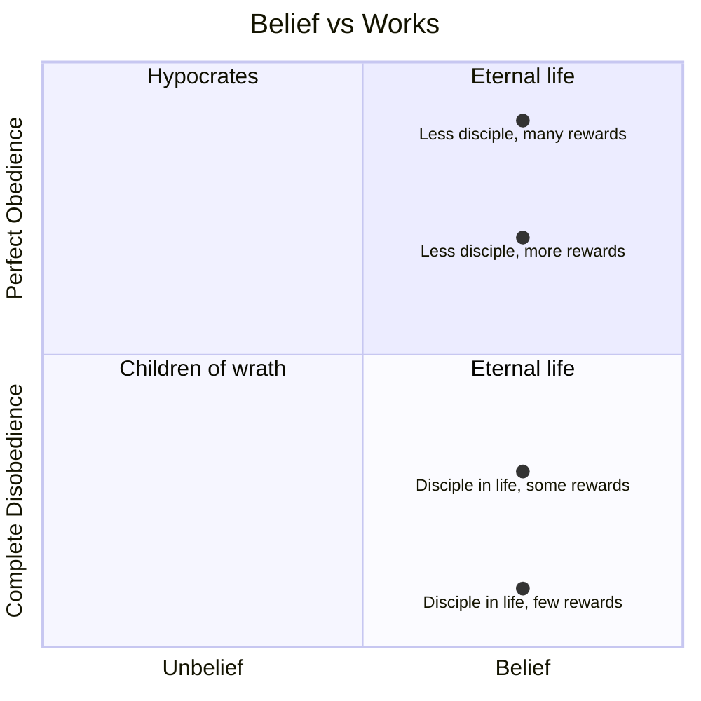

Everyone either believes or disbelieves. No one is in 100% complete rebellion to God and no one lives a life of perfect obedience.

But some believers don't obey well and are disciplined during life and gain very few rewards during judgement. They believe but their discipleship is lacking. They are true believers and have eternal life, but their life on Earth is unproductive and useless.

And there are those who try to be good enough and obey. They will be told, "depart from me I never knew you." These people profess to be a disciple but never believed. They think their good works are sufficient to gain God's favor.

